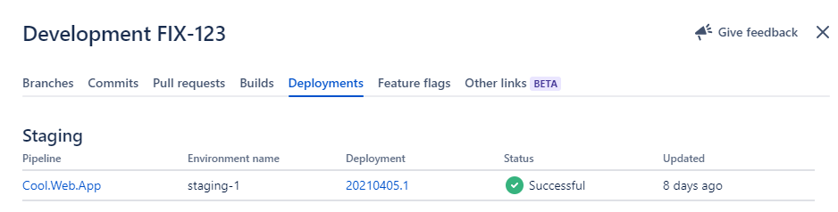

Azure DevOps <-> Jira Deployment Information
==
Updates the deployment information in Jira from Azure Devops YAML pipelines.

These sets of scripts utilize Azure Devops preDeploy/deploy/success/failure steps to update the pipelines status in Jira.



Pipeline Usage
==

Set the following variables in your AzureDevops job : 

- AtlassianClientId from : https://companyname.atlassian.net/secure/admin/oauth-credentials
- AtlassianClientSecret from : https://companyname.atlassian.net/secure/admin/oauth-credentials
- JiraDomain : companyname.atlassian.net

```yaml
resources:
  repositories:
  - repository: JiraDeployInfo
    type: github
    name: educationperfect/azure-jira-update
    endpoint: NameOfYourAzureDevOpsGithubServiceConnection
...
  jobs:
      - deployment: ...
        strategy:
          runOnce:
            preDeploy:
              steps:
                - {template: update-jira.yml@JiraDeployInfo, parameters: { JiraState: "Pending", JiraEnvironment: "Testing"}} 
                # JiraState can be one of "Unknown", "Pending", "InProgress", "Cancelled", "Failed", "RolledBack", "Successful"
                # JiraEnvironment can one of "Unmapped", "Development", "Testing", "Staging", "Production"
            on:
              failure:
                steps:
                  - {template: update-jira.yml@JiraDeployInfo, parameters: { JiraState: "Failed", JiraEnvironment: "Testing" }}
              success: 
                steps:
                  - {template: update-jira.yml@JiraDeployInfo, parameters: { JiraState: "Successful", JiraEnvironment: "Testing" }}
            deploy:
              steps:
                - {template: update-jira.yml@JiraDeployInfo, parameters: { JiraState: "InProgress", JiraEnvironment: "Testing" }}
                ...
```

Powershell usage
==

The powershell can be used directly to update Jira outside of Azure Devops. Either `-AtlassianClientId` and `-AtlassianClientSecret` need to be provided or environment variables `ATLASSIAN_CLIENT_ID` and `ATLASSIAN_CLIENT_SECRET`.

### Example
```ps
Add-JiraDeploymentInformation -JiraDomain "companyname.atlassian.net" `
   -Issues @("OPS-1118") `
   -State Unknown `
   -DisplayName "test" `
   -Label "test" `
   -Url "https://test.com" `
   -Description "test" `
   -PipelineId "test" `
   -PipelineDisplayName "Test" `
   -PipelineUrl "http://test.com" `
   -EnvironmentId "test" `
   -EnvironmentDisplayName "test" `
   -EnvironmentType "Unmapped" `
   -Product "PowerShell"`
```

### Help
```
NAME
    Add-JiraDeploymentInformation

SYNOPSIS
    Adds deployment information to Jira


SYNTAX
    Add-JiraDeploymentInformation [[-JiraDomain] <String>] [[-Issues] <String[]>] [[-AtlassianClientId] <String>] [[-AtlassianClientSecret] <String>] [[-State] <String>] [-DisplayName] <String> [-Label] <String> [-Url] <String> [-Description] <String> [-PipelineId] <String> [-PipelineDisplayName] <String> [-PipelineUrl] <String> [-EnvironmentId] <String>
    [-EnvironmentDisplayName] <String> [[-EnvironmentType] <String>] [[-Product] <String>] [<CommonParameters>]
    

DESCRIPTION
    Submits deployment information to Jira issues so that deployments can be tracked to a CI/CD system


PARAMETERS
    -JiraDomain <String>
        For example something.atlassian.net

    -Issues <String[]>
        List of issues to attach to the deployment information

    -AtlassianClientId <String>
        OAuth Client ID for Atlassian which can be generated at https://companyname.atlassian.net/secure/admin/oauth-credentials - Defaults to $env:ATLASSIAN_CLIENT_ID if not set

    -AtlassianClientSecret <String>
        OAuth Client Secret for Atlassian which can be generated at https://companyname.atlassian.net/secure/admin/oauth-credentials - Defaults to $env:ATLASSIAN_CLIENT_SECRET if not set

    -State <String>
        "Unknown", "Pending", "InProgress", "Cancelled", "Failed", "RolledBack", "Successful"

    -DisplayName <String>
        The Display Name used in Jira

    -Label <String>
        The Label Name used in Jira

    -Url <String>
        The URL that Jira links to

    -Description <String>
        Description that is submitted to Jira

    -PipelineId <String>
        The PipelineId that's sent to Jira

    -PipelineDisplayName <String>
        The Pipeline Display Name for show in Jira

    -PipelineUrl <String>
        The Pipeline Url to show in Jira

    -EnvironmentId <String>
        The Environment ID that's sent to Jira

    -EnvironmentDisplayName <String>
        The Environment Display Name to show in Jira

    -EnvironmentType <String>
        "Unmapped", "Development", "Testing", "Staging", "Production"

    -Product <String>
        Name of the product updating the data

    <CommonParameters>
        This cmdlet supports the common parameters: Verbose, Debug,
        ErrorAction, ErrorVariable, WarningAction, WarningVariable,
        OutBuffer, PipelineVariable, and OutVariable. For more information, see
        about_CommonParameters (https://go.microsoft.com/fwlink/?LinkID=113216).

    -------------------------- EXAMPLE 1 --------------------------

    PS > Add-JiraDeploymentInformation -JiraDomain "companyname.atlassian.net" -Issues @("OPS-1118") -State Unknown -DisplayName "test" -Label "test" -Url "https://test.com" -Description "test" -PipelineId "test" -PipelineDisplayName "Test" -PipelineUrl "http://test.com" -EnvironmentId "test" -EnvironmentDisplayName "test" -EnvironmentType "Unmapped" -Product "PowerShell"
```
